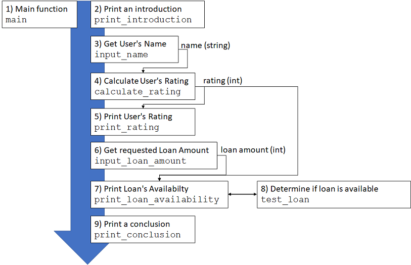

# Functional Magic

### Step 8 - Putting It All Together

Congratulations! You've succesfully decomposed a large problem into an equally
large program! This is a very complex task, but you've adequately demonstrated
the ability to accomplish hard things.

Now, the only thing left to do is integrate all of the subcomponents of your
program into a single control flow. To do this, write a function called `main`
at the bottom of your program. This function will call most of the functions you
already wrote, and do so in a particular order to make the program run as
intended. This of this function as the conductor of an orchestra, directing the
various members of the orchestra to play their part at the right time and in the
right way.

To understand the correct order of operations for this program, study the
intended flow of data in the diagram below (if you can't see the diagram, open
the image `flow_diagram.png` in the `doc` directory of this problem or <a href="https://computing.utahtech.edu/cs/1400/sneks_files/flow_diagram.png">here</a>).



Recall that variables cannot move between functions, and instead think about
what values must move and how to pass them from function to function (denoted by
the black arrows). Think about how the data should flow through the program,
follow the arrows in the diagram, and call the functions of your program
accordingly.

Notice in the diagram that we ask you to call the `calculate_rating` function.
You'll remember that you did not implement this function, Grindlehook did! You
will find this function in the `operations.py` file. Make sure to import this
file/module and, at the correct place, use it to call the `calculate_rating`
function as intended. Here is the correct import statement to use:

`import operations`

Then you can call `calculate_rating` like this:

`operations.calculate_rating(name)`

(Notice we are passing in the name of the person to the function.)

### Testing Your Program

To test your function (and complete the step), paste the following code at the
very bottom of the file, and then run the program:

```
if __name__ == '__main__':
    main()
```

You will learn more about this code snippet later. For now, it suffices to say
that it will trigger the main execution of your program at the correct time.
